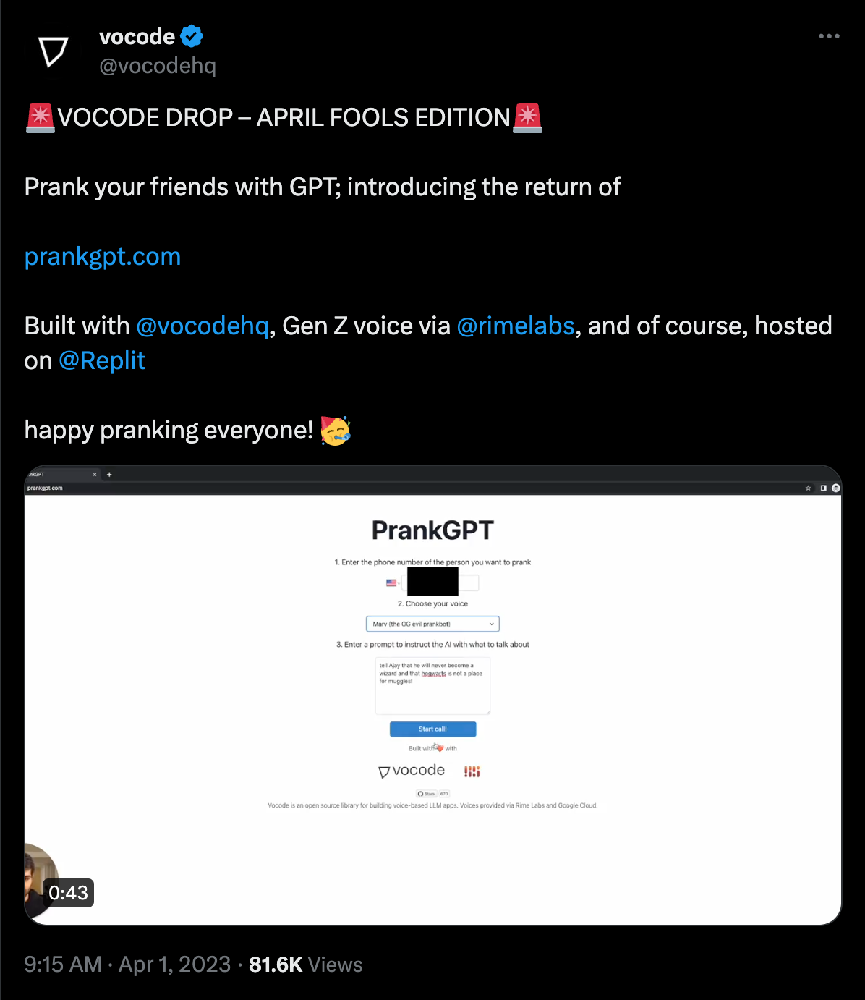

# Vocode Fullstack Take-home Assessment

# Background

April Fools' Day is quickly approaching, and Vocode is planning on re-releasing [PrankGPT](https://prankgpt.com)! In 2023, PrankGPT was built on top of the [Vocode open-source library](https://github.com/vocodedev/vocode-python). In 2024, we'll be building it on top of the [Vocode hosted API](https://docs.vocode.dev/hosted-quickstart).

[](https://twitter.com/vocodehq/status/1642199067064434688)

# Part 1: Form View

Rebuild the PrankGPT form - it should accept a U.S. phone number, a free-form prompt, and a choice between two voices — see `frontend/src/app/api/calls/route.ts`.

The submit button on the form should trigger the Create Call route handler (see below).

## Backend: Executing calls with Vocode

On PrankGPT, users enter a phone number and a prompt, select a voice, and are able to spin off a prank call.

Under the hood, we'll use the `/v1/calls/create` endpoint to execute the call — see `frontend/src/app/api/calls/route.ts` for boilerplate.

# Part 2: List Calls View

Create a second pane/page that displays the calls that have been executed in a table. Here's an example of a Call object that comes from the Vocode API:

```
{
  "id": "0e1ef4b1-aecf-4f8d-9871-99d21ad169da",
  "status": "ended",
  "error_message": null,
  "recording_available": true,
  "transcript": "[00:00.17] BOT: Hey, thanks for calling Voh Code, who am I speaking with?\n[00:10.32] HUMAN:  Oh, this is Masa.\n[00:10.73] BOT: Hey Masa, nice to meet you!\n[00:13.40] BOT: What's on your mind today?\n",
  "stage": "picked_up",
  "stage_outcome": "human_disconnected",
  "to_number": "****",
  "from_number": "****",
  "agent": {
    "prompt": {
      "content": "OBJECTIVES\n1. You are a human in the middle of a phone conversation. You are representing Vocode, an AI startup backed by Google Ventures that also graduated from Y Combinator.",
    },
    "language": "en",
    "actions": [],
    "voice": {
      "voice_id": "****"
      "version": "2",
      "type": "voice_play_ht"
    },
    "initial_message": "Hey, thanks for calling Voh Code, who am I speaking with?",
  },
  "agent_phone_number": "****",
  "start_time": "2024-01-20T20:33:50.181660Z",
  "end_time": "2024-01-20T20:35:39.558660Z",
}
```

You'll be writing a subset of these fields to your database (see below). For the purposes of this exercise, plan for large volumes of calls — i.e. the table should be paginated, allow users to filter/sort on relevant fields, etc.

## Backend: Storing calls

The Vocode API allows users to subscribe to webhooks that notify on events that occur during calls. The Create Call route handler (in `frontend/src/app/api/calls/route.ts`) configures a webhook that hits the Metadata route handler (in `frontend/src/app/api/calls/metadata/route.ts`).

The starter code in the Metadata route handler uses the `/v1/calls` endpoint on the Vocode API to query for the full information on the call. Write this information to PrankGPT's internal database - here, we'd like you to use [Supabase](https://supabase.com/). Use [`pg_graphql`](https://github.com/supabase/pg_graphql) in order to expose this data to the frontend.

# Setup

Don't worry about user auth for now - assume every user sees the same view.

## Vocode Setup

1. Using your Vocode account (which should be upgraded to the developer tier before you start the interview), create a new API key and buy a phone number ([walkthrough](https://docs.vocode.dev/getting-number))
2. Create `.env.local` from `.env.local.example` and fill in your Vocode API key and phone number
3. Tunnel the dashboard to a public URL using [`ngrok`](https://ngrok.com/) or similar - copy the URL to `NEXT_PUBLIC_BASE_URL` in `.env.local` so that your server can accept the webhook.

## Supabase Setup

Follow the [Supabase local setup instructions](https://supabase.com/docs/guides/cli/local-development) and enable [`pg_graphl`](https://supabase.com/docs/guides/database/extensions/pg_graphql).

# Guidelines

The assessment is designed to be completed in 4 hours or less. While of course most of this code will be in MVP state, please demonstrate your ability to write clean, well-structured code that is easy to understand and extend.

# Submission

Please submit:

- All of your work as commits to this repository (it's dedicated to you!)
- A quick video of you (committed to the repo or attached via email) walking us through your UI and how it works - [Loom](https://www.loom.com/) works well for this and is free!
